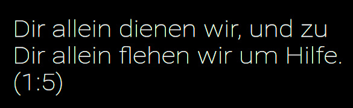
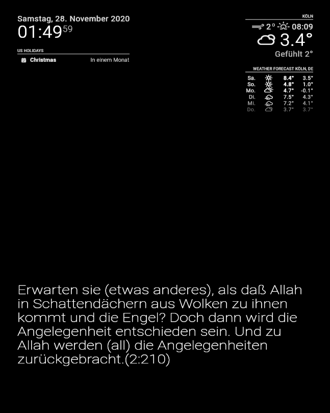
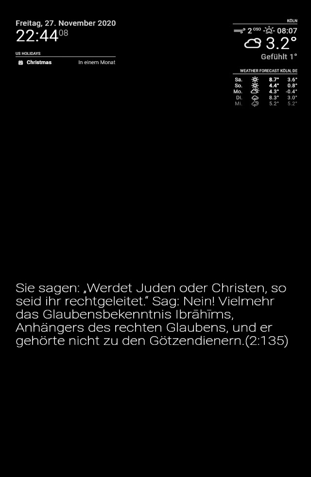

# Module: MMM-KoranGerman
# MMM-KoranGerman

The `MMM-KoranGerman` module is like the default module `Compliments` of MagicMirror2 with the difference that the `MMM-KoranGerman` module does not show Compliments but German translation of verses from the Koran.

This module displays random Verses of Koran.

## Screenshots





## Using the module

```bash
cd ~/MagicMirror/modules/default
git clone https://github.com/jakobsarwary1/MMM-KoranGerman
```
then go to ```bash default.js 
```

To use this module, add it to the modules array in the `config/config.js` file:
````javascript
modules: [
	{
		module: "MMM-Koran-German",
		position: "lower_third",	// This can be any of the regions.
						// Best results in one of the middle regions like: lower_third
						
		}
	}
]
````

#### Multi-line:
Use `\n` to split text into multiple lines, e.g. `First line.\nSecond line.` will be shown as:
```
First line.
Second line.
```

